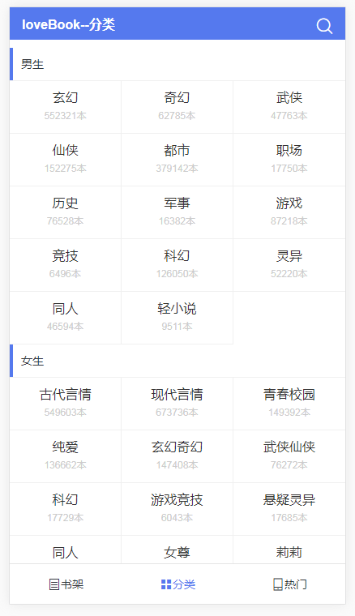
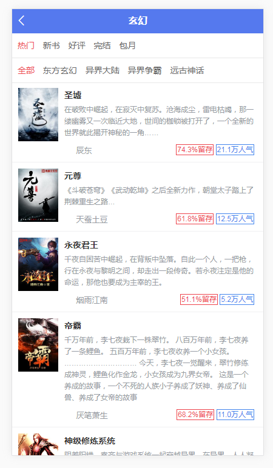
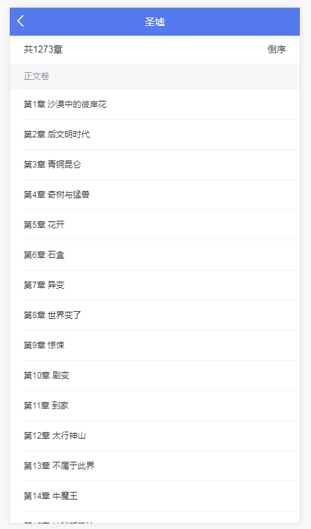
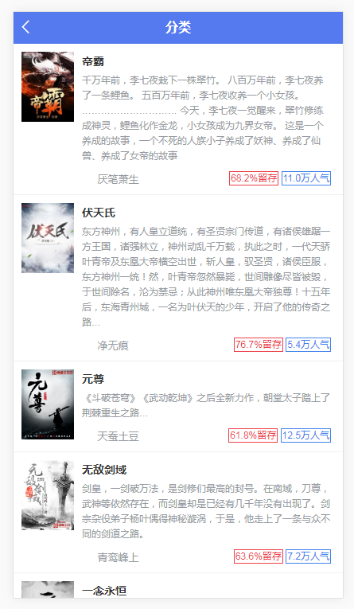
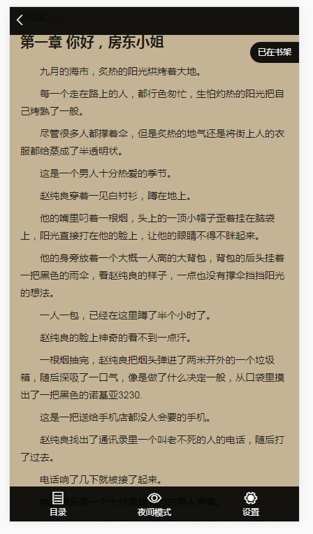
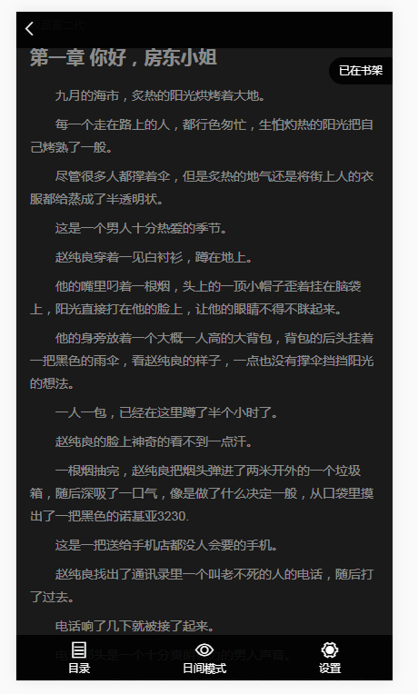
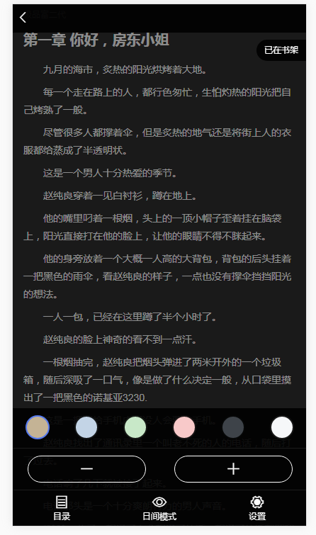
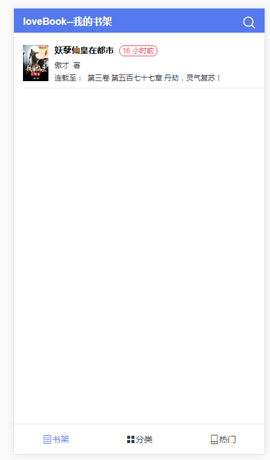
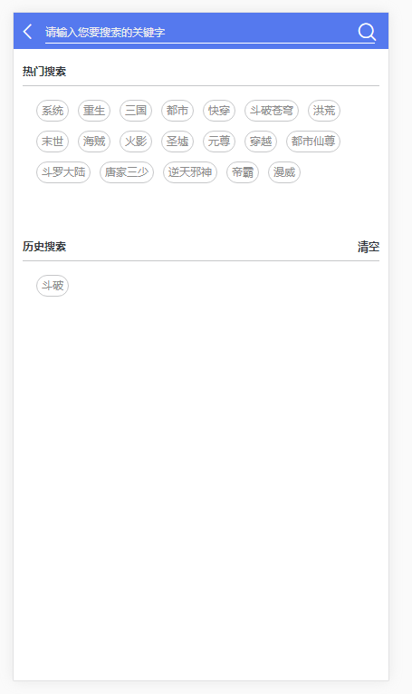
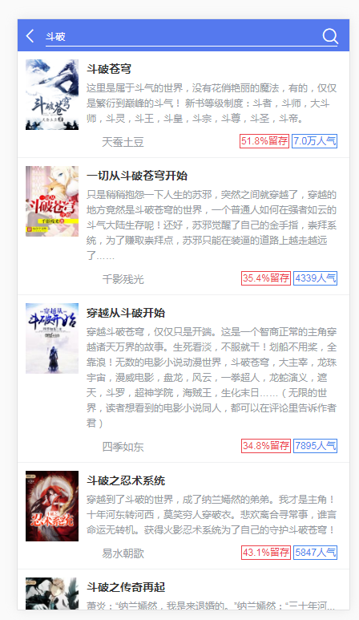

# [loveBook](https://github.com/saucxs/loveBook)
[](https://github.com/saucxs/loveBook)
[](https://github.com/saucxs/loveBook/blob/master/LICENSE)
[](https://github.com/saucxs/loveBook/stargazers)
[](https://github.com/saucxs/loveBook/network)
[](https://github.com/saucxs/loveBook/issues)

loveBook爱上阅读，是一款webapp的读小说等书籍的并且阅读的应用。如果觉得可以，欢迎fork和star。
自己最近在追斗破苍穹电视剧，下班时候在地铁上总听到有人说，斗破苍穹书籍比电视剧好看，于是想弄个看书的webapp，
这样在手机上看电子书很爽。找了好久发现发现只有追书神器的api暴露出来了，起点之类的api找不到。

### 技术栈
vue2 + vuex + vue-router + webpack + ES6 + axios + sass

### 源码地址
[https://github.com/saucxs/loveBook](https://github.com/saucxs/loveBook) 

### 演示地址
[线上地址（正在开发其他模块）](http://book.mwcxs.top) 


### 版本功能
- [x] Element UI
- [x] 热门模块-男生热门，女生热门，女频限免三部分
- [x] 分类模块-男生，女生，出版三部分
- [x] 分类详情模块-分为热门，新书，好评，完结，包月，根据小说内容分为全部，东方玄幻，异界大陆，异界争霸，远古神话
- [x] 书籍详情模块-包含书籍一些基本信息和简介，书籍目录入口，热门书评，同类推荐，包含加入书架功能，和立即阅读
- [x] 书籍目录模块-包含一共多少章，章节顺序（倒叙）
- [x] 同类推荐列表模块
- [x] 阅读模块-包含目录，昼夜阅读模式，以及字体调整和书籍背景颜色设置
- [x] 书架模块-包含加入到书架展示，以及上次阅读地方存储
- [x] 搜索模块-包含热搜的内容和历史搜索内容，以及清空历史搜索内容

+ 2018.10.17
   - 完成热门模块
   - 完成类别列表
   - 完成书籍详情
+ 2018.10.21
    - 完成分类模块
    - 完成章节目录
    - 完成阅读模块
+ 2018.10.24
    - 完成书架模块
+ 2018.10.25
    - 完成模糊搜索功能
    - 清空搜索历史功能
    - 修复bug：部署之后阅读章节返回的错误

### 项目运行

```   
git clone https://github.com/saucxs/loveBook

cd loveBook

npm install

npm run dev（本地运行 访问：http://localhost:8083）

npm run build （部署上线 生成的dist文件夹放到服务器中即可：需要配置代理，如使用nginx，可参考下面问题中的配置）

```

### 项目截图
#### 热门模块

#### 分类模块

#### 分类详情模块

#### 书籍详情模块

#### 书籍目录模块

#### 同类推荐列表模块

#### 阅读模块

#### 阅读模块-夜间

#### 立即阅读模块-设置

#### 书架模块

#### 搜索模块-搜索前

#### 搜索模块-搜索后


### 说明 
是基于[structure_webApp](https://github.com/saucxs/structure_webApp)架子上进行添加业务逻辑。

